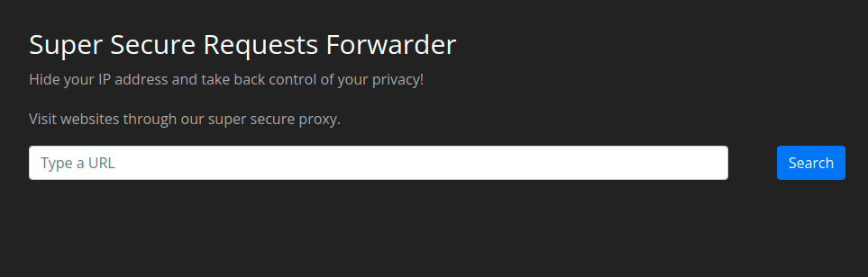
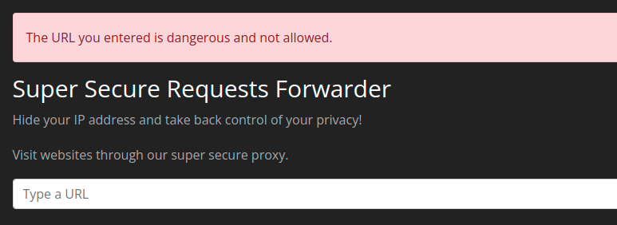
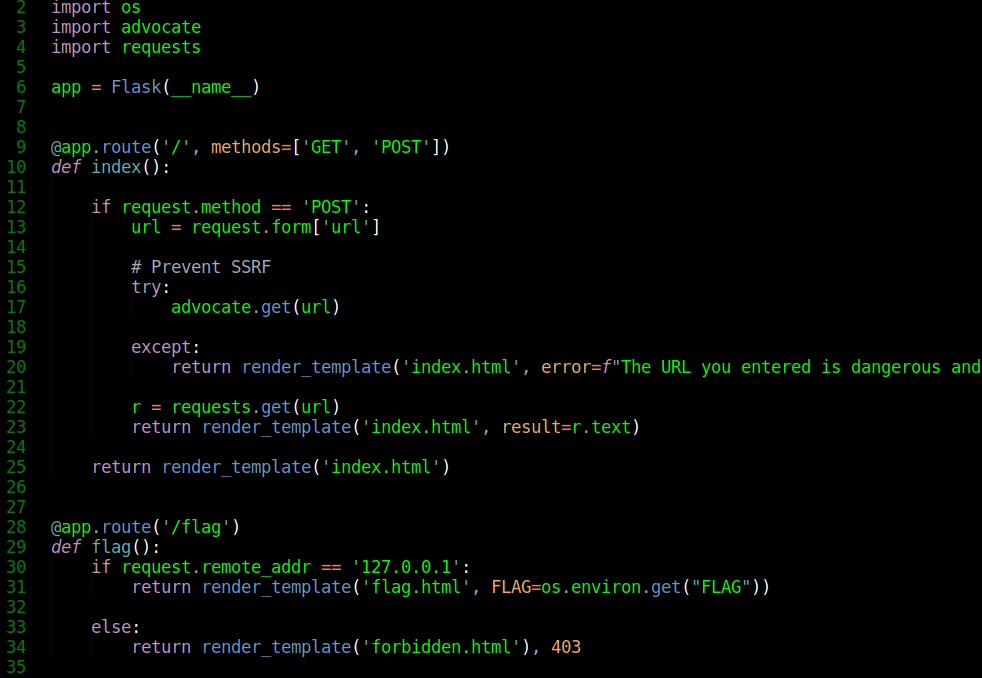
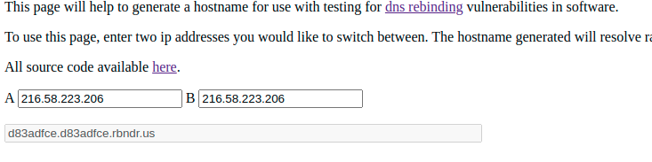
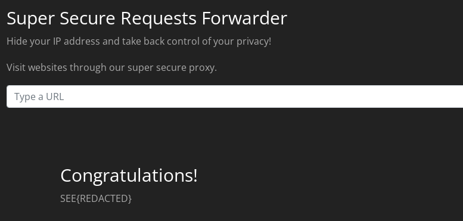

# SSRF SEETF 2022 (100 pts)

### CHALLENGE

files for this challenge can be found [here](../../challenges/ssrf_seetf_2022)

### LOCAL SETUP

```bash
cd <challenge_folder>

# you should have docker and docker-compose installed (google, if otherwise)

docker-compose up
```

### SOLUTION
once you have completed the local setup, visting 127.0.0.1 you should have a page like below: 



so the idea is that you can provide any link and the application will retrieve and display it for you (try it out :smile:), 
this would be a typical ssrf scenario if we can leverage this functionality to retrieve sensitive internal application or 
system information, but attempting to retrieve links like [http://127.0.0.1](http://127.0.0.1) results in error like below:



from the above image we can tell that there is some sort of ssrf protection in place, what to do? well, luckily we have access to
source code so let's see what checks have been implemented. Digging into [app.py](../../challenges/ssrf_seetf_2022/app.py) we find
the following



on line 17 we see that [advocate](https://pypi.org/project/advocate/) is used to prevent ssrf and it's quite good at it, is it impossible
to bypass? not yet proven, but it is better we take another route if available. Looking closely on line 22 we see that after the url has
been checked by **advocate** it's being passed to **requests library** to retrieve the url. We can easily see that this is a classical
**TIME OF CHECK TIME OF USE (TOCTOU)** vulnerability, so if we could change the ip address between the time of check by
***advocate*** and time of use by ***request*** then we can bypass the ip-level filtering done by ***advocate***, and that's exactly
what [dns rebind](https://en.wikipedia.org/wiki/DNS_rebinding) attack does. There is an online service by
[Tavis Omandy](https://twitter.com/taviso) that allows you to quickly test for dns rebind attacks without having to deal with setting up
nameservers e.t.c you can find it here: [rebinder](https://lock.cmpxchg8b.com/rebinder.html). So the game plan is simple; our goal is to
get the flag at ***line 31*** in the ***/flag*** route and to reach it we have to pass the check at ***line 30***, i.e our remote address
will have to be ***127.0.0.1*** to accomplish this we use rebinder as below:



so now any dns request to ***http://d83adfce.d83adfce.rbndr.us/flag*** will receive a response of either ***127.0.0.1*** or
***216.58.223.206*** the latter the address to google.com (and advocate will allow it), so if we make sufficiently large number
of request (*burp* intruder will suffice here) we will end up with a scenario where ***advocate*** make the first request to the dns
and gets a response of ***216.58.223.206*** and ***requests*** makes the second request and ends up with ***127.0.0.1***, when
that happens we have the second request being ***http://127.0.0.1/flag*** and the remote address will also be ***127.0.0.1***, **check
passed** you will get the following:



challenge solved!
